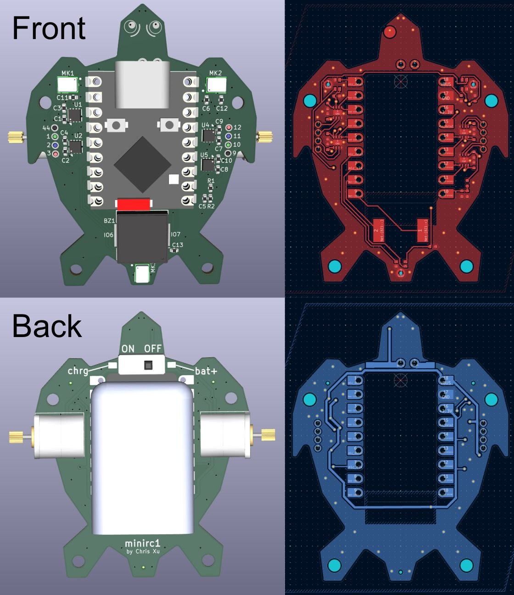
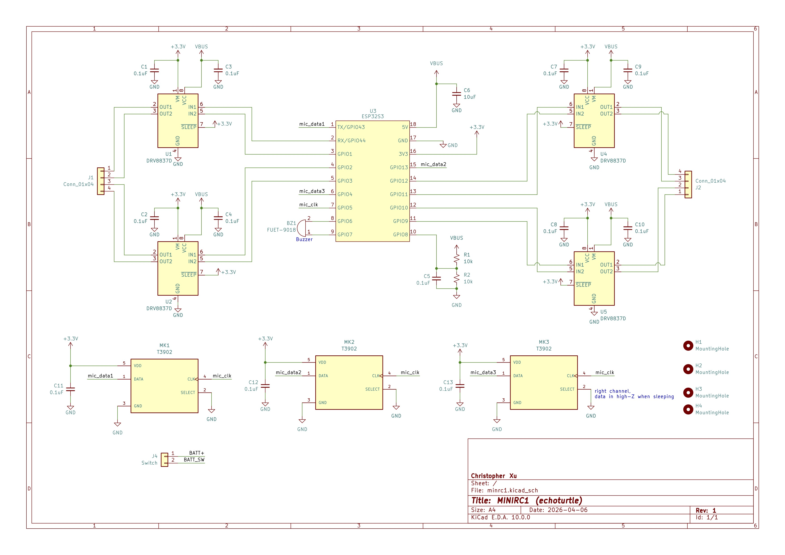

# pcblearning
A collection of PCB and firmware projects for learning PCB design. Projects are designed to have few components, cheap, yet rich in potential features.

## minrc1
Tiny wheeled robot with two PM08 stepper motors, three microphones, and a buzzer. ESP32S3 supermini dev board allows for wireless control, USB-C battery charging, and running small neural networks. Microphones and buzzer may be useful for locating other robots, echolocation, and detecting surface properties (through vibration/noise from ground contact).

